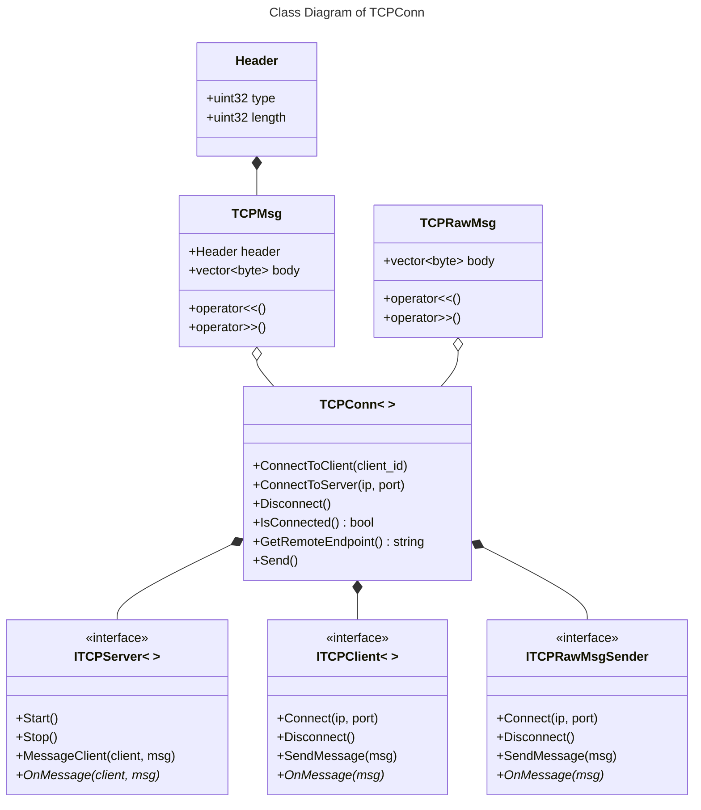

# TCPConn

The TCP communication repository for the lab-scale production system physical / digital Twin. 

> Developed by *Bohan LENG*

## Built With

`c++20` `g++-13` `boost-asio`

## Project Details

TCP communication library developed with `BOOST_ASIO`. Coded with Pimp (Pointer to Implementation) paradigm to remove the prerequisites for library users.

Two types of TCP messages, `TCPMsg` and `TCPRawMsg` are defined, serving the purposes of both header-style message and header-less raw message transmission. `TCPMsg` can be used for self-created applications for long messages. `TCPRawMsg` can be used to transmit bytes with custom protocols, but the length of each message is limited to a certain number of bytes.

The socket, server, client classes are built accordingly. Template classes `TCPConn`, `TCPServer`, `TCPClient` can all be instantiated using either `TCPMsg` or `TCPRawMsg`, forming into different TCP connections for various scenarios. `TCPRawMsgSender` sends raw bytes for low-level communications.

## Class Diagram

